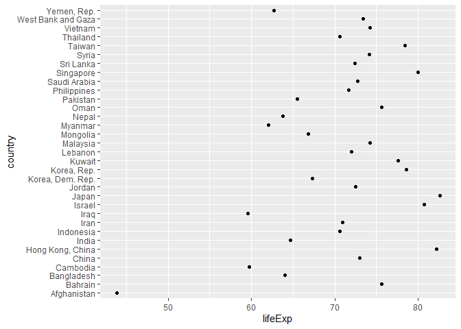
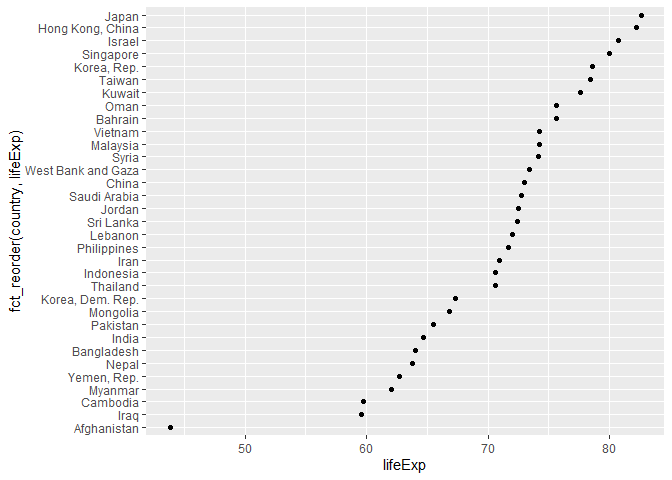
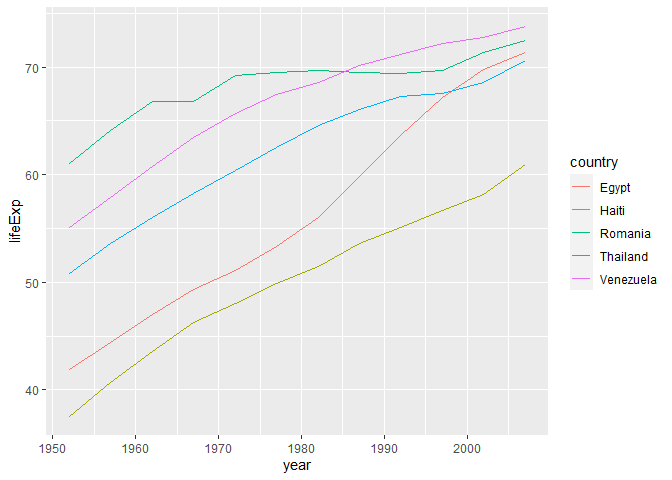
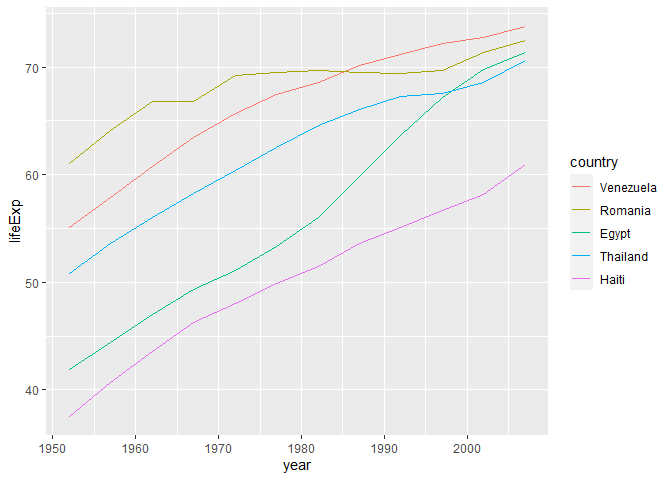

```r
library(tidyverse)
```

```
## Warning: package 'tidyverse' was built under R version 3.6.3
```

```
## -- Attaching packages -------------------------------------------------------------------------------------------------------------- tidyverse 1.3.0 --
```

```
## v ggplot2 3.3.0     v purrr   0.3.3
## v tibble  2.1.3     v dplyr   0.8.3
## v tidyr   1.0.2     v stringr 1.4.0
## v readr   1.3.1     v forcats 0.5.0
```

```
## Warning: package 'ggplot2' was built under R version 3.6.3
```

```
## Warning: package 'tidyr' was built under R version 3.6.3
```

```
## Warning: package 'forcats' was built under R version 3.6.3
```

```
## -- Conflicts ----------------------------------------------------------------------------------------------------------------- tidyverse_conflicts() --
## x dplyr::filter() masks stats::filter()
## x dplyr::lag()    masks stats::lag()
```

```r
library(gapminder)
```

```
## Warning: package 'gapminder' was built under R version 3.6.3
```


```r
gap_asia_2007 <- gapminder %>% filter(year == 2007, continent == "Asia")
ggplot(gap_asia_2007, aes(x = lifeExp, y = country)) + geom_point()
```

<!-- -->

```r
ggplot(gap_asia_2007, aes(x = lifeExp, y = fct_reorder(country, lifeExp))) +
  geom_point()
```

<!-- -->


```r
h_countries <- c("Egypt", "Haiti", "Romania", "Thailand", "Venezuela")
h_gap <- gapminder %>%
  filter(country %in% h_countries) %>% 
  droplevels()
ggplot(h_gap, aes(x = year, y = lifeExp, color = country)) +
  geom_line()
```

<!-- -->

```r
ggplot(h_gap, aes(x = year, y = lifeExp,
                  color = fct_reorder2(country, year, lifeExp))) +
  geom_line() +
  labs(color = "country")
```

<!-- -->

